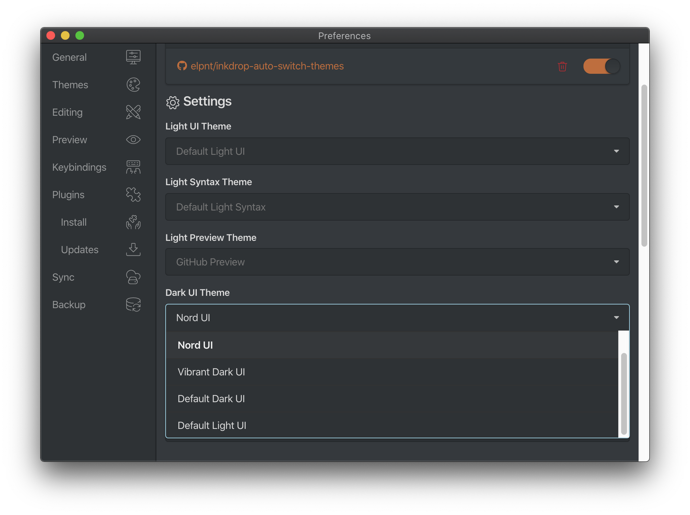

# auto-switch-themes

Automatically switch the themes based on the system's light/dark mode.

## Configuration

Select your light and dark UI/Syntax/Preview modes in _Inkdrop > Preferences > Plugins > auto-switch-themes_ menu.

The default settings are as follows.

|         | Light                | Dark                |
| ------- | -------------------- | ------------------- |
| UI      | Default Light UI     | Default Dark UI     |
| Syntax  | Default Light Syntax | Default Dark Syntax |
| Preview | GitHub Preview       | GitHub Preview      |
